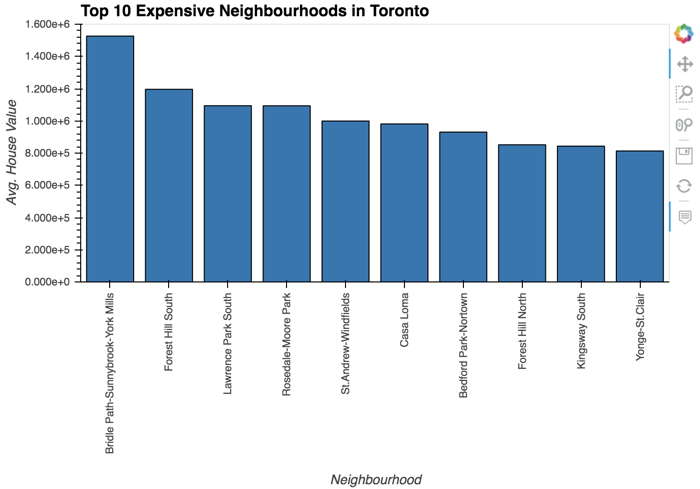

# Toronto Real Estate Analysis
## Unit 6 - Pyviz Homework

*[Photo by James Wheeler](https://www.pexels.com/@souvenirpixels?utm_content=attributionCopyText&utm_medium=referral&utm_source=pexels) | [Free License](https://www.pexels.com/photo-license/)*

## Background

This dashboard's goal is to provide charts, maps, and interactive visualizations that help customers explore the data and determine if they want to invest in rental properties in Toronto.

The data provided for this homework was retrieved from the following websites:

* [Toronto Open Data](https://open.toronto.ca/)

* [Census Profile, 2016 Census - Toronto Metropolitan Area, Ontario and Canada](https://www12.statcan.gc.ca/census-recensement/2016/dp-pd/prof/details/page.cfm?Lang=E&Geo1=CMACA&Code1=535&Geo2=PR&Code2=01&SearchText=toronto&SearchType=Begins&SearchPR=01&B1=All&TABID=1&type=0)

### Dashboard

Using the Panel library, an interactive dashboard is build for all of the visualizations. This dashboard has tabs which you can use to toggle over the different analyses.

Sample Dashboard:

  

---

## Welcome Tab
### Neighbourhood Map

To start off, you can see the neighbourhood location data in an interactive map with the average prices per neighbourhood. 

  

---

## Yearly Analysis Tab

In this section, you can visualize:

### Number of Dwelling Types by the Year

In this section, the number of dwelling types per year can be visualized as a bar chart.

Colored Bar Charts

 

---

## Shelter Costs vs Housing value - Tab

### Average Monthly Shelter Costs in Toronto Per Year

In this section, you can visualize the average monthly shelter costs per year to understand rental income trends over time better. The average (mean) shelter cost for owned and rented dwellings per year is plotted as a line chart

   

### Average House Value per Year

In this section, you can determine the average house value per year. An investor may want to better understand the sales price of the rental property over time. For example, a customer will want to know if they should expect an increase or decrease in the property value over time so they can determine how long to hold the rental property. 

  

---

## Neighbourhood Analysis tab - Tab

### Average Prices By Neighbourhood

In this section, you can compare the house value by neighbourhood, by selecting the neighbourhood of interest from the drop-down list.

  

### Number of Dwelling Types per Year

In this section, you can visualize the number of dwelling types per year in each neighbourhood. You want to provide investors a tool to understand the evolution of dwelling types over the years. You can select the neighbourhood of interest from the drop-down list.

---

## Top Expensive Neighbourhood Tab

### Top 10 Most Expensive Neighbourhoods

In this section, you can see which neighbourhoods are the most expensive.

And also a sunburst chart to conduct a cost analysis of the most expensive neighbourhoods in Toronto per year.

   

---

### Dashboard Bokeh Server

The dashboard is also compatible to be hosted on server using the Panel Serve command.

---

# References

All resources, including but not restricted to Text, Images, data, etc, were referenced from the original homework files. Content used in this README.MD file is taken from the original README.MD provided in the homework folder, for the sole purpose submitting this assignment. 

---

